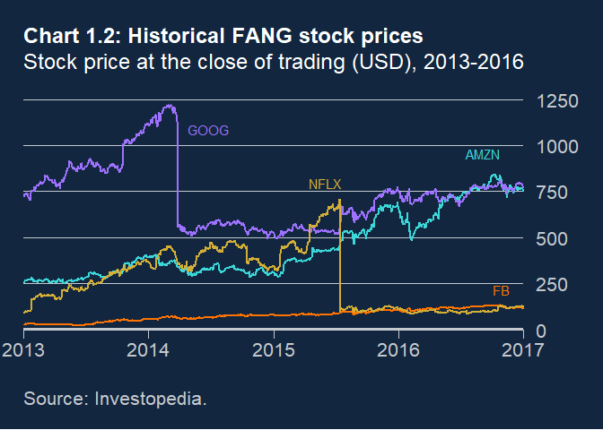

<!-- README.md is generated from README.Rmd. Please edit that file -->
boeCharts
=========

Overview
--------

`boeCharts` is an R package containing Bank chart styles and themes, in-line with [Bank standards on corporate identity](https://bankofengland.frontify.com/d/RPk6pMZziBFw/bank-standards), recommended (and designed) for use in conjunction with [ggplot2](https://ggplot2.tidyverse.org/). It currently houses designs for approximating charts found within a number of flagship publications:

-   [Bank Overground](https://www.bankofengland.co.uk/bank-overground)
-   [Inflation Report](https://www.bankofengland.co.uk/inflation-report/2018/august-2018/global-economic-and-financial-market-developments)
-   [Statistical Releases](https://www.bankofengland.co.uk/statistics/money-and-credit/2019/april-2019)

Install
-------

`boeCharts` is an R package/library best used via R Studio (installed from the [software catalogue](http://sccm-wl-mgt-01/CMApplicationCatalog)).

Get the latest stable version of `boeCharts` by running the below code within an R session:

``` r
# install remotes package (required for local package installs)
if (!require("remotes")) install.packages("remotes")

# install boeCharts
install.packages("http://collaborate/workspaces/RHelpCentre/R%20documents/Packages/boeCharts_1.1.0.zip", repos = NULL, type = "binary")

# install any missing dependencies from CRAN
remotes::install_deps(find.package("boeCharts"))
```

Use
---

`boeCharts` provides native support for use with [ggplot2](https://ggplot2.tidyverse.org/) (a popular R graphics library). You can use `scale_[colour|fill]_[continuous|discrete]_boe` functions for adopting Bank colour palettes within charts generated by `ggplot2`, and `theme_xxx` functions for applying full chart styles supported by `boeCharts`.

Both longer form guides and quick-start examples are included below.

### Articles

Cookbooks:

-   [Introduction to boeCharts - produce “Bank-ready” data visualisation with ggplot2](http://collaborate/workspaces/RHelpCentre/R%20Markdown/boeCharts_intro.html)
-   [Visualising Distributions](http://collaborate/workspaces/RHelpCentre/R%20Markdown/ChartsVisualisingDistributions.html)
-   [Other charts from SPERI speech](http://collaborate/workspaces/RHelpCentre/R%20Markdown/ChartsOthers.html)

Vignettes:

-   [Using boeCharts](http://collaborate/workspaces/RHelpCentre/R%20Markdown/using-boeCharts.html)
-   [Bank-standard colours with boeCharts](http://collaborate/workspaces/RHelpCentre/R%20Markdown/Bank-standard-colours-with-boeCharts.html)
-   [‘Last-mile’ formatting](http://collaborate/workspaces/RHelpCentre/R%20Markdown/last-mile-formatting.html)

### A minimal example

Here is an out-of-the-box `ggplot2` chart.

``` r
# load ggplot2
library(ggplot2)

# build chart
chart <- ggplot(iris, aes(Sepal.Length, Sepal.Width, color = Species)) +
  # jittery scatter
  geom_jitter(size = 3)

# print chart
chart
```


Below, the [Bank Overground](https://www.bankofengland.co.uk/bank-overground) chart theme and a "vibrant" Bank colour combination are added to the same object.

``` r
# load boeCharts
library(boeCharts)

chart <- chart +
  # add Bank Overground theme
  theme_overground() +
  # add a "vibrant" Bank colour combination
  scale_colour_discrete_boe(palette = "vibrant_c")

# print
chart
```


### A more in-depth example

Another `ggplot2` + `boeCharts` creation, this time investigating some more customization options. The [`gghighlight`](https://yutannihilation.github.io/gghighlight/) library is also featured in this example.

``` r

# load extra packages
library(gghighlight)

# create chart
ggplot(data = FANG, aes(x = date, y = close, colour = symbol)) +
  # add lines, tweak line width 
  geom_line(size = 0.7, show.legend = FALSE) +
  # highlight netflix stocks
  gghighlight(symbol == "NFLX", unhighlighted_colour = boe_neutral$stone,
              use_group_by = FALSE, use_direct_label = FALSE) +
  # add some chart labels
  labs(title = "BoE Palette Test",
       subtitle = "A plot for demonstration purposes",
       y = "Closing\nprice", x = NULL) +
  # use 'highlights' palette
  scale_colour_discrete_boe(palette = "boe_highlights") +
  # add Bank Overground theme
  theme_overground(axis_text_size = 11) +
  # apply custom axis settings
  scale_y_continuous(expand = c(0, 0), breaks = seq(0, 1250, 250), 
                     limits = c(0, 1250), position = "right") +
  scale_x_date(expand = c(0, 0), labels = boe_date_labels(),
               breaks = seq(min(FANG$date), max(FANG$date), by = "3 months"))
```



### A disclaimer on fonts

Font handling in R is tricky, partly because they are implemented differently depending on OS (e.g. Windows, Mac) and graphics device (e.g. on-screen, PDF, svg). In the latest `boeCharts` release, the "Calibri" font family (used by default in `theme_overground`) is registered with R when the package is loaded on a Windows device. However, font behaviour may change unexpectedly depending on the OS and graphics device you're using.

Alternatively, here are some known libraries to consider:

-   [ragg](https://ragg.r-lib.org/) - Graphic devices for R based on the AGG library
-   [showtext](https://cran.r-project.org/web/packages/showtext/index.html) - Using Fonts More Easily in R Graphs
-   [extrafont](https://cran.r-project.org/web/packages/extrafont/) - Tools to using fonts (most core functionality blocked on standard Bank devices)

Contribute
----------

This is an ongoing project to abstract and consolidate Bank charting guidelines, and any/all contributions are encouraged. Inspecting the source code in this repository will help with understanding how to make a custom palette, or building a chart theme for your business area. The following resources are also helpful (and inspired much of this effort):

-   [Modify components of a theme](https://ggplot2.tidyverse.org/reference/theme.html)
-   [govstyle](https://github.com/ukgovdatascience/govstyle)
-   [hrbrthemes](https://github.com/hrbrmstr/hrbrthemes)
-   [Building a new theme](https://bookdown.org/rdpeng/RProgDA/building-a-new-theme.html)

Also, for general consideration when contributing to the package, try to:

-   Observe principles in Hadley Wickham's [R Packages book](https://r-pkgs.org/)
-   Follow the Git branch (see [here](https://blog.rstudio.com/2017/09/13/rstudio-v1.1-the-little-things/) for how to create a branch from within R Studio) & [pull request](https://docs.microsoft.com/en-us/azure/devops/repos/git/pullrequest?view=azure-devops) model, or [contact Ewen](mailto:ewen.henderson@bankofengland.co.uk)

### To do

-   Chart export destination helpers (e.g. 16x9 ppt half size)
-   More extensive "using grey" examples, poss a vignette/cookbook demonstrating `gghighlight`
