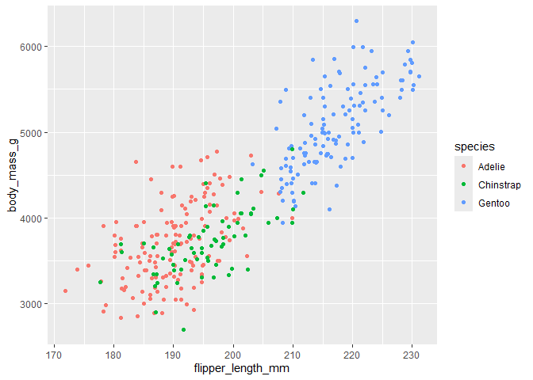
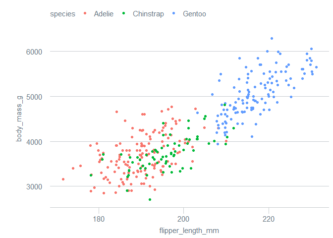

<!-- README.md is generated from README.Rmd. Please edit that file -->

# boeCharts

## Overview

`boeCharts` is an R package to help you create charts that are in-line
with [the Bank’s visual identity
standards](https://bankofengland.frontify.com/d/RPk6pMZziBFw/bank-standards),
recommended (and designed) for use in conjunction with
[ggplot2](https://ggplot2.tidyverse.org/). It contains design patterns
for approximating charts found within flagship publications, including:

-   [Bank Overground](https://www.bankofengland.co.uk/bank-overground)
-   [Monetary Policy
    Report](https://www.bankofengland.co.uk/monetary-policy-report/2019/november-2019)
    (FKA Inflation Report)
-   [Financial Stability
    Report](https://www.bankofengland.co.uk/financial-stability-report/2019/july-2019)
-   [Statistical
    Releases](https://www.bankofengland.co.uk/statistics/money-and-credit/2019/april-2019)

N.B. this is still a maturing project. Feedback/issues/contributions
appreciated. If you are reporting a bug/error and/or requesting a new
feature, please try and use [the boeCharts
backlog](https://almplatform/tfs/UnmanagedCollection/Shared%20Analytical%20Code/_backlogs/backlog/boeCharts/Requirements).
For questions and other discussion, please use the [Data
Community](https://bankexchange/groups/1067/SitePages/Home.aspx).

## Installation

`boeCharts` is not likely to be submitted to CRAN. Get the latest
development version from GitHub:

``` r
remotes::install_github('bank-of-england/boeCharts', ref = "public")
```

## Usage

### Complementing a ggplot2 worflow

`boeCharts` provides native support for use with
[ggplot2](https://ggplot2.tidyverse.org/) (a popular R graphics
library). You can use `scale_[colour|fill]_[continuous|discrete]_boe`
functions for adopting Bank colour palettes within charts generated by
`ggplot2`, and `theme_xxx` functions for applying full chart styles
supported by `boeCharts`.

#### A minimal example

First, load packages:

``` r
library(boeCharts)
library(ggplot2)
library(palmerpenguins) # for example purposes only
```

Here is an out-of-the-box `ggplot2` chart.

``` r
ggplot(penguins, aes(flipper_length_mm, body_mass_g, color = species)) +
  geom_jitter()
```



Custom themes can be applied to ggplot objects as additional “layers”.
As mentioned above, all `boeCharts` theme functions are prefixed by
`theme_` e.g. `theme_overground()` applies the [Bank
Overground](https://www.bankofengland.co.uk/bank-overground) chart
theme:

``` r
ggplot(penguins, aes(flipper_length_mm, body_mass_g, color = species)) +
  geom_jitter() +
  # add Bank Overground theme
  theme_overground()
```



Custom ggplot scales help with applying Bank colour palettes. In this
case, the points can be coloured with a “vibrant” Bank colour
combination variant, via `scale_colour_discrete_boe()`, again as an
additional ggplot layer:

``` r
ggplot(penguins, aes(flipper_length_mm, body_mass_g, color = species)) +
  geom_jitter() +
  theme_overground() +
  # add a "vibrant" Bank colour combination
  scale_colour_discrete_boe(palette = "vibrant_c")
```


Now, switching in the [Monetary Policy
Report](https://www.bankofengland.co.uk/monetary-policy-report/2019/november-2019)
theme and pre-MPC colours. Additionally, `scale_y_continuous()` is used
to move the y-axis across to the right.

``` r
ggplot(penguins, aes(flipper_length_mm, body_mass_g, color = species)) +
  geom_jitter() +
  # add MPR theme
  theme_mpr() +
  # add a "vibrant" Bank colour combination
  scale_colour_discrete_boe(palette = "pre_mpc") +
  # move the y-axis to the right
  scale_y_continuous(
    position = "right", sec.axis = dup_axis(labels = NULL)
    )
```


#### An in-depth example

Another `ggplot2` + `boeCharts` creation, this time investigating some
more customization options, including:

-   automatic axis breaks/limits (using
    `boe_breaks|limits_date|numeric()`)
-   direct line labels (using `position_voronoi()`)
-   non-standard y-axis title positioning (using `move_ylab()`)
-   markdown

``` r
# create chart
chart <- ggplot(data = FANG, aes(x = date, y = close, colour = symbol)) +
  # add lines + hide legend
  geom_line(lwd = 0.75, lineend = "round", show.legend = FALSE) +
  # add series labels + hide legend
  geom_text(
    aes(label = symbol), position = position_voronoi(), 
    family = "Calibri", show.legend = FALSE
    ) +
  # add some chart labels
  labs(
    title = "Chart 1.2: Historical FANG stock prices", 
    subtitle = 'Daily stock prices for "FB", "AMZN", "NFLX" and "GOOG" (FANG), 2013-2016',
    caption = caption_boe(source = "Investopedia"),
    y = "Stock price at the close of trading (USD)", x = NULL
    ) +
  # use 'highlights' palette
  scale_colour_discrete_boe(palette = "boe_highlights") +
  # add Bank Overground theme
  theme_overground() +
  # apply custom axis settings
  scale_y_continuous(
    expand = c(0, 0), breaks = boe_breaks_numeric(), 
    limits = boe_limits_numeric(), position = "right"
    ) +
  scale_x_date(
    expand = c(0, 0), labels = boe_date_labels(),
    breaks = boe_breaks_date(), limits = boe_limits_date()
    )

# re-position y axis title above plot
move_ylab(chart)
```


#### Markdown theme variants

A Markdown variant of each {boeCharts} theme has been made with a `md_`
suffix, like `theme_mpr_md()`. These themes add support for rendering
text as markdown, thanks to the
[ggtext](https://wilkelab.org/ggtext/index.html) package. Here’s an
example:

``` r
mpr_chart <- chart +
  # apply custom axis settings
  scale_x_date(
    labels = boe_date_labels(),
    breaks = boe_breaks_date()
    ) +
  theme_mpr_md(axis_title_size = 9, axis_text_size = 9, caption_size = 9) +
  labs(
    title = "**Chart A.2** Historical FANG stock prices",
    subtitle = 'Daily stock prices for "FB", "AMZN", "NFLX" and "GOOG" (FANG), 2013-2016<sup>(a)</sup>',
    caption = caption_boe(source = "Investopedia", footnote = "A minor data detail.")
    )

move_ylab(mpr_chart)
```


### Using custom fonts

`boeCharts` helps you safely import and use fonts other than the basic
fonts R already uses (with help from the `extrafont` package). These
fonts can be imported using an associated `import_` utility function.
For example, to import Calibri (used by default in some `boeCharts`
themes), you should run the `import_calibri()` function. If you want to
use fonts in PDF (or Postscript) output files, set the
`boeCharts.loadfonts` option to `TRUE`.

N.B. the font import step only needs to be run once on your machine.
Fonts will be loaded automatically when you load `boeCharts` in future R
sessions.
